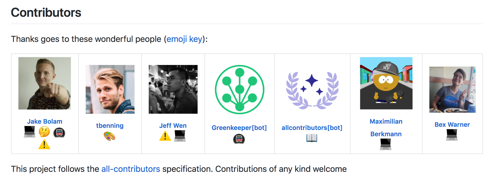

# Welcome to the All Contributors website repository

> Call for translators! [We're looking for translators](https://github.com/all-contributors/all-contributors/issues/143) to help translate this spec for everyone!

This is a specification for recognizing contributors to an open-source project in a way that rewards every contribution, not just code.

The basic idea is this:

> Use the project README (or another prominent public documentation page in the project) to recognize the contributions of members of the project community.

People are giving themselves and their free time to contribute to open source projects in so many ways, so we believe everyone should be praised for their contributions (code or not).

## The All Contributors Table

Below is an example of how using the all-contributors spec table can recognize all contributors.

> You can use [the @all-contributors bot 🤖](https://allcontributors.org/bot/overview) to automate acknowledging contributors to your open source projects

## Specification

The [specification](https://allcontributors.org/specification) is detailed on [allcontributors.org](https://allcontributors.org)

## Emoji key

The [Emoji Key](https://allcontributors.org/reference/emoji-key/) ✨ (and Contribution Types) can be found on [allcontributors.org](https://allcontributors.org)

## Contributing

If you've ever wanted to contribute to open source, and a great cause, now is your chance!

See the [contributing docs](https://allcontributors.org/project/contribute) for more information

## Contributors ✨

Thanks go to these wonderful people ([emoji key](https://allcontributors.org/emoji-key)):

<!-- ALL-CONTRIBUTORS-LIST:START - Do not remove or modify this section -->
<!-- prettier-ignore-start -->
<!-- markdownlint-disable -->
<!-- markdownlint-restore -->
<!-- prettier-ignore-end -->

<!-- ALL-CONTRIBUTORS-LIST:END -->

This project follows the [all-contributors](https://allcontributors.org) specification.
Contributions of any kind are welcome!

## LICENSE

[MIT](LICENSE)
